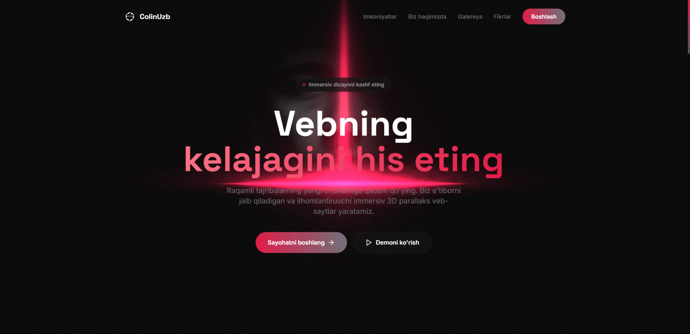
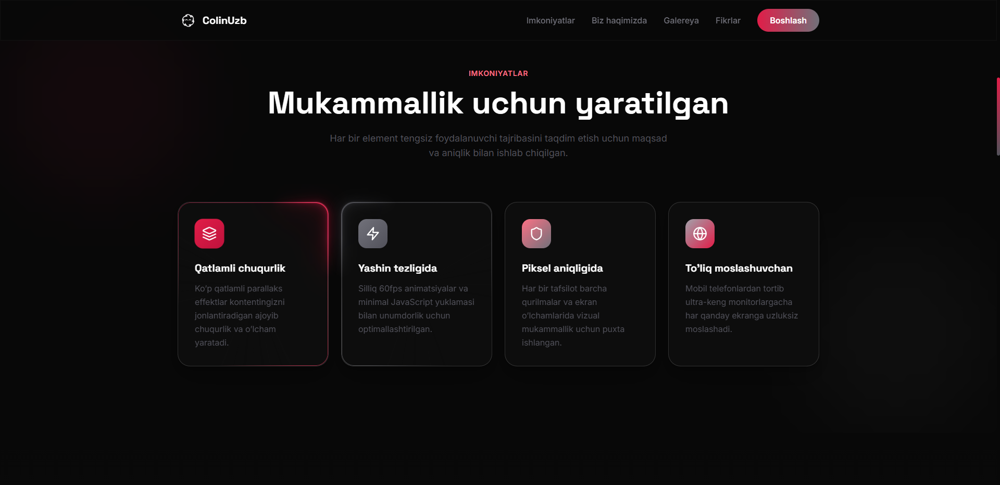
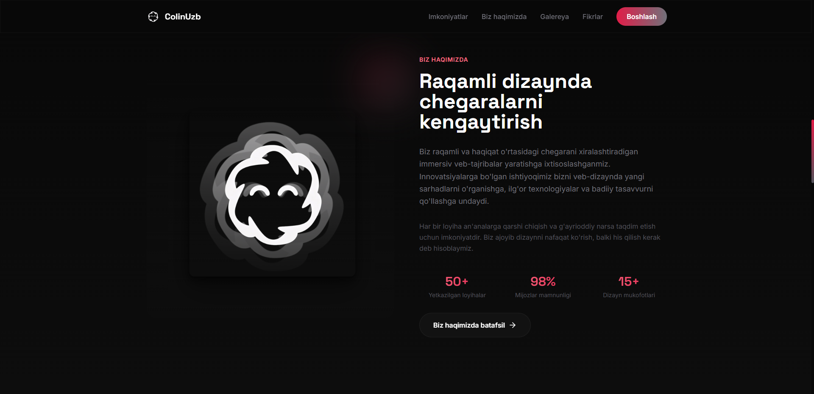

 

  

# 🚀 ColinWeb

### O'zbek kontent yaratuvchilari va geymerlari uchun premium platforma

---

# 🌟 ColinWeb Nima?

ColinWeb — zamonaviy dizayn, kuchli funksiyalar va professional foydalanuvchi tajribasini birlashtirgan kontent almashish platformasi.

Bu yerda foydalanuvchilar:

✨ Dizaynlarini ulashadi

🎮 O'yin resurslarini joylaydi

📁 Fayllarni yuklaydi

💬 Hamjamiyat bilan muloqot qiladi

❤️ Postlarga baho beradi

🔥 Trend kontentlarni kuzatadi

🚀 O'z profilini rivojlantiradi

---

# 🎥 Live Preview

---

# ⚡ Texnologiyalar

---

# 🛠 Tech Stack

| Technology   | Description            |
| ------------ | ---------------------- |
| 🌐 HTML5     | Strukturaviy sahifalar |
| 🎨 CSS3      | Zamonaviy dizayn       |
| ⚡ JavaScript | Interaktivlik          |
| ⚛️ React     | Frontend Framework     |
| 🐍 Python    | Backend Services       |
| 🐘 PHP       | Server Logic           |
| 🗄️ Database | Ma'lumotlar bazasi     |
| 🎨 Figma     | UI/UX Design           |
| 🚀 Vite      | Fast Build Tool        |

---

# 🔥 Asosiy Imkoniyatlar

## 👤 Profil Tizimi

✅ Avatar

✅ Bio

✅ Statistikalar

✅ Foydalanuvchi ma'lumotlari

---

## 📦 Postlar

📁 Fayl ulashish

🎨 Dizaynlar

🎮 O'yin resurslari

📝 Qo'llanmalar

📥 Download tizimi

---

## ❤️ Hamjamiyat

👍 Like

💬 Komment

⭐ Save

🔥 Trending

👥 Community

---

## 🎨 Dizayn

✨ Glassmorphism

✨ Gradient UI

✨ Neon Effect

✨ Responsive

✨ Dark Mode

✨ Smooth Animation

---

# 📸 Screenshots

## 🏠 Home Page

---

## 👤 Profile Page

---

## 📦 Resource Section

---

# 📊 Platform Statistics

---

# 🚀 Future Updates

* [x] Chat System
* [ ] Responsive Design
* [ ] User Profiles
* [ ] AI Assistant
* [ ] Mobile Application
* [ ] Premium Accounts
* [ ] Advanced Analytics
* [ ] Realtime Notifications

---

# 🌍 Live Demo

### 🚀 Website

https://colinuzb.github.io/ColinWeb/

---

# ❤️ Support

Agar loyiha sizga yoqqan bo'lsa:

⭐ Star bosing

🍴 Fork qiling

🚀 Ulashing

💜 Communityga qo'shiling

---

# Build • Share • Inspire

### Made with ❤️ by ColinUzb

